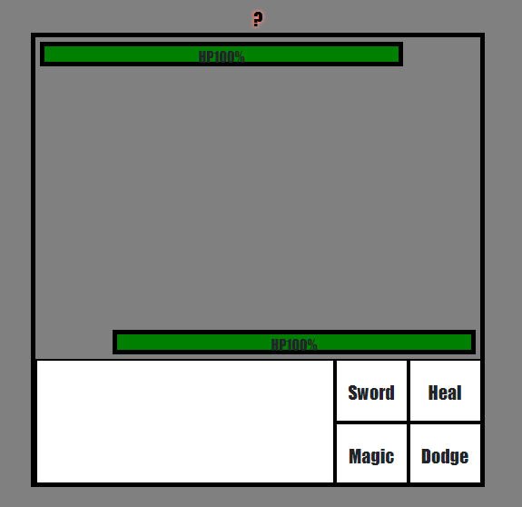
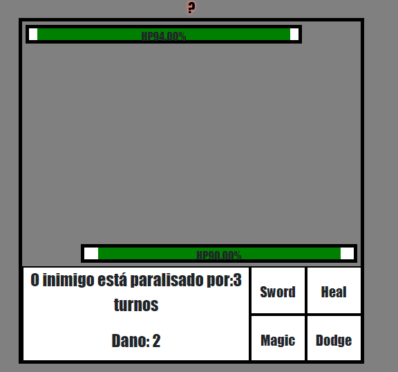
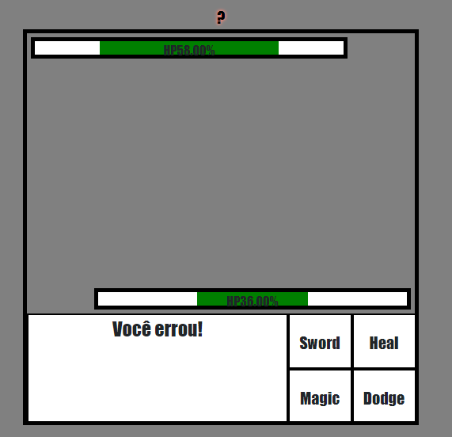
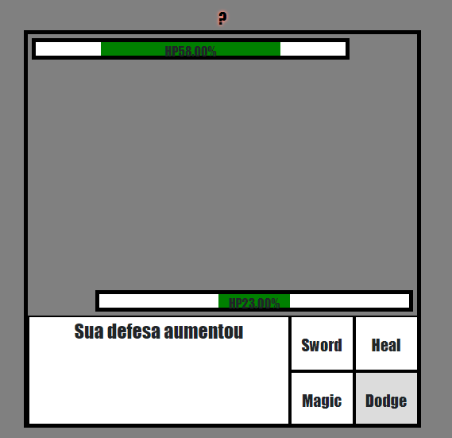

# Battle-RPG
Protótipo de uma batalha de RPG de turnos

Tela inicial

Exemplo de magia utilizada, onde existe uma pequena porcentagem de deixar o inimigo atordoado de 1 a 3 turnos

Exemplo de ataque falho

Exemplo de dodge

